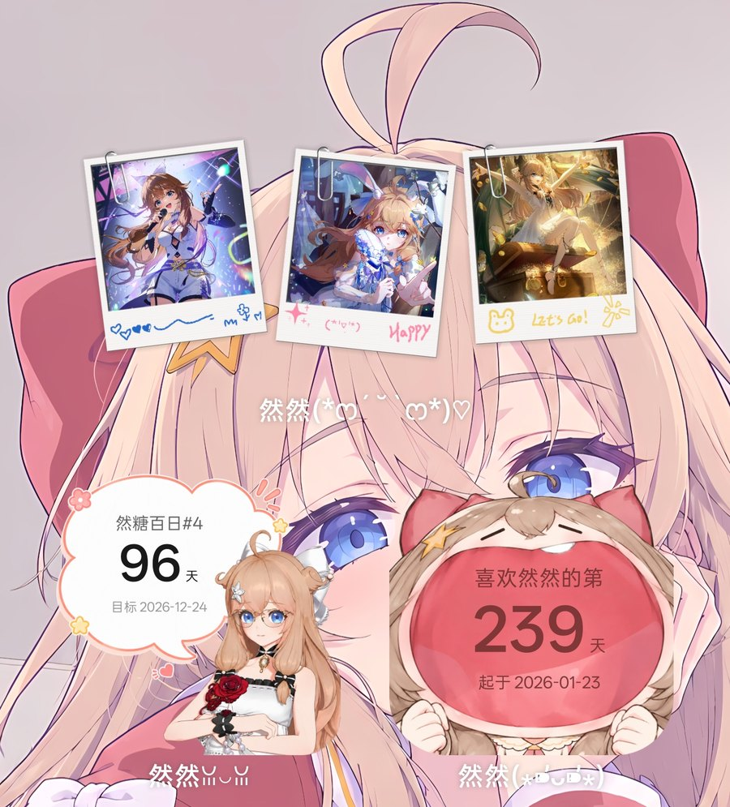
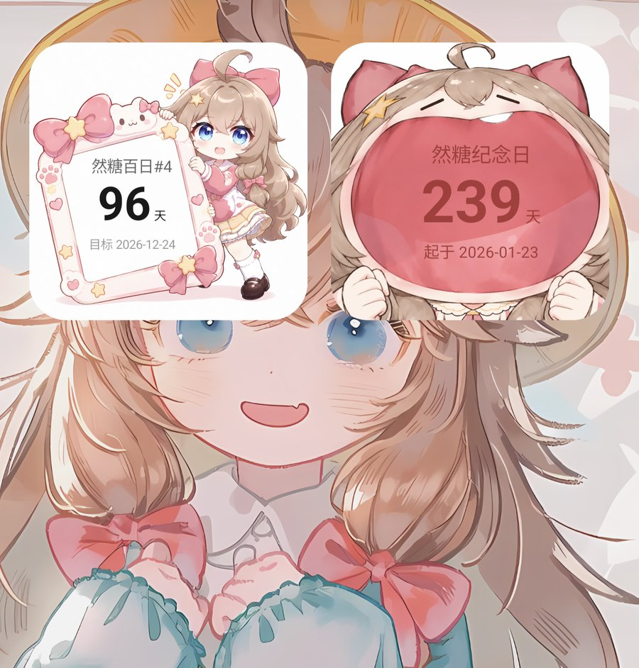

# 纪念日小组件（CountDay）

> 应用显示名：**纪念日**（原名「倒数日」）。

一个极简的安卓桌面小组件：**记录某个日期还有多少天，或者从某天起已经过去多少天。**

- 没有应用界面，没有桌面图标（没有 `MAIN`/`LAUNCHER` 入口），装完只出现在小组件列表里。
- 可以添加任意多个实例，每个实例的标题 / 日期 / 类型 / 背景 / 图片 / 排版都各自独立、随时可改。
- 桌面格子可拉伸（2x2 到约 4x4），卡片本身也能设成精确尺寸。
- 支持加载 PNG，**保留透明通道**；**背景色和文字颜色**都用调色板任选，透明度、文字位置、文字大小都能调。
- **卡片尺寸可以精调**：填满格子、按格子短边的百分比缩放（可锁定为正方形），
  或者**让卡片比例跟随图片尺寸**（不裁剪、不留白）。
- 图片**完全铺满组件**（等比放大 + 居中裁切，不留白），透明处露出背景色。
- **圆角大小可调**（0~60dp，0 = 直角）；透明图片的直角不会戳出卡片圆角。
- 支持 Android 8.0 及以上；不需要任何权限，**没有后台常驻**，也不会定时唤醒。
- 不依赖任何第三方库，APK 只有 70 多 KB。

## 效果





## 使用

1. 先构建出 APK（见文末「构建」），然后安装：`adb install -r dist/countday-1.4.apk`
2. 桌面长按空白处 →「小组件」→ 找到「纪念日」→ 拖到桌面（默认 2x2）。
3. 首次放置会弹出配置框：

   | 分组 | 说明 |
   |---|---|
   | 标题 | 显示在卡片上，例如「生日」 |
   | 类型 | *倒计时*（距离目标日期还有 N 天）／*已经过去多少天*（从起始日期到今天） |
   | 日期 | 点按钮弹出日期选择器 |
   | 背景色 / 文字颜色 | 顶部切换编辑对象，下面用**调色板**（色相滑杆 + 饱和度/明度方块）任选颜色；勾「默认」则跟随系统深浅色 |
   | 不透明度 | 0%~100%，作用在当前选中的那个颜色上 |
   | 卡片尺寸 | 「填满格子」／「跟随图片」（卡片按图片宽高比，不裁剪不留白）／「自定义」按格子短边百分比缩放（可勾「锁定为正方形」） |
   | 圆角 | 0~60dp（0 = 直角），卡片和图片用同一个值 |
   | 文字位置 | 竖直：上/中/下；水平：左/居中/右；再加**水平/垂直微调**滑杆（±50%，1% 一档） |
   | 文字大小 | 50%~200%（四行文字整体缩放） |
   | 图片 | 选择 PNG／裁剪（拖动+缩放，始终铺满）／移除 |
   | 预览 | 一个和桌面小组件同比例的小卡片，实时显示最终效果 |

4. 保存后即可。
5. 以后再想改，有两个入口：
   - **长按小组件 →「设置」**
   - **在小组件上连点三下**（单击、双击都不响应，避免误触）

「清空」按钮会删掉该实例的配置和图片（小组件本身留在桌面上）。

### 图片是复制进来的，和相册里的原图无关

选图后图片会被复制到应用内部（原图和裁剪后的成品各一份），之后只读自己的副本。所以
**把相册里那张原图删掉、或者换手机相册，都不会影响小组件**；应用也不会申请任何读相册的权限。

如果应用内的**原图副本**被系统清理掉了（一般是清理 App 数据时才会发生），编辑器会提示
"原图副本已不在"，此时裁剪会基于成品图进行 —— 功能还在，只是画质会略差。

### 调整大小

两层尺寸概念：

1. **桌面格子**：直接拖四周把手拉伸（最小 2x2，最大约 4x4，受桌面网格限制）。
2. **卡片本身**：配置页里的「卡片尺寸」有三种：
   - **填满格子**：卡片 = 桌面给的格子大小。
   - **跟随图片**：卡片取**图片的宽高比**，在格子里取能放下的最大同比例矩形（等比缩放塞进格子）。
     这样图片正好铺满卡片 —— 既不会被裁掉内容，也不会有留白，
     圆角也能完整烘进位图。比例取自**原图**（宽/高），选了新图就立刻跟着变；没选图时退化成填满格子。
   - **自定义**：用**占格子短边的百分比**表示，100% = 能放下的最大正方形；
     勾上「锁定为正方形」再拖比例条，就能得到严格的正方形。超出格子的部分渲染为透明，卡片居中显示。

尺寸变化后，卡片和图片都会按新尺寸重新渲染（图片按目标分辨率出图，所以不会糊），文字块也按设置重新对齐。

> 精确尺寸依赖 Android 12（API 31），更低版本会自动退化成"填满格子"。

### 关于图片和裁剪

组件的叠放顺序是：**背景色卡片 → 你的图片 → 文字**。

图片**必须完全铺满卡片**：等比放大到盖住整个卡片，再居中裁掉多出来的部分，不会留白。
PNG 的透明区域会露出下面的背景色 —— 适合「中间透明」的边框 / 贴纸 / logo 素材；
如果放一张满幅实景照片，中间的文字会压在照片上，会比较难读。

点「裁剪」可以调整显示哪一部分（框的比例 = 卡片比例，方便对照）：

- 单指拖动 = 移动图片；双指捏合 = 缩放；也可以点 `－` / `＋` 按钮；
- **图片始终完全盖住框**：不能缩到比框小，也不能拖出框外（拖到头就停、正好贴边），框内不会露出空白；
- 「重置」= 等比放大到刚好盖住框并居中；
- **框内看到的就是最终显示的内容**（框外的部分会被裁掉）。想完全不裁，就把「卡片尺寸」设成「跟随图片」。

## 构建

工具链放在项目之外的独立目录 `$HOME/.countday-env`（JDK + Android SDK），不写 `~/.gradle`、
不写系统目录、不需要 root：

```bash
bash $HOME/.countday-env/setup-sdk.sh   # 一次性准备工具链
cd ~/CountDay
./build.sh                              # 产物 dist/countday-1.4.apk（已签名，可直接安装）
./build.sh --clean

bash tools/run-tests.sh                 # 纯逻辑校验，不连真机
```

也可以用 Android Studio 直接打开工程；或先写 `local.properties` 里的 `sdk.dir`，再 `gradle assembleDebug`。

可用环境变量覆盖：`COUNTDAY_ENV`、`JAVA_HOME`、`ANDROID_SDK_ROOT`、`API_LEVEL`、
`BUILD_TOOLS_VERSION`、`MIN_SDK`、`VERSION_CODE`、`VERSION_NAME`。

想彻底清理：`rm -rf $HOME/.countday-env ~/CountDay/build ~/CountDay/dist`

> 设计与实现笔记（为什么没有 Service、图片怎么交给桌面、缩放的坑等）见 [`docs/DESIGN.md`](docs/DESIGN.md)。
